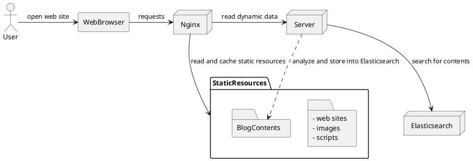

# Architechture



## Deployment

```plantuml

start
:tag release;
:checkout release sources by CICD;
:test and build package;
:upload package to deployment machine;
if (deploy server) then (Y)
  :set up server;
  :test if it works well;
elseif (deploy web) then (Y)
  :set up web;
  :test if it works well;
elseif (deploy blog contents)
  :upload latest blog contents;
  :trigger server to analyze latest blog contents;
  :store analysis into Elasticsearch;
else (nothing)
endif

end
```
