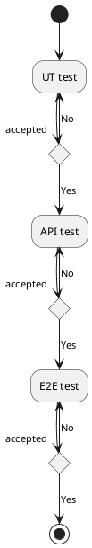

# Test strategy

## UT
Test case proportions: 40%   
Test phase: coding
```
Output UT test cases during implementation code,ensure that the program's logic and expectations are consistent.
```
## API
Test case proportions: 50%   
Test phase: dev
```
Verify that the API implements functionality correctly.
Overrides all parameters of the API.
```
### Tools
postman/jmeter
### Scenarios
```
1. The range and boundaries of parameters
2. Type of parameter
3. Parameter duplicate or missing
4. notexist/null/empty
5. Maybe some injection attack scripts
```
## E2E
Test case proportions: 10%   
Test phase: stage/deployment
### Tools
GUI autotest framework?
### Function
```
Some smoking test cases
```
### Compatibility
```
1. Different browsers
2. Different resolutions
3. Different access clients (PC/Pad/Phone)
```
## Other test
### Performance
#### Tools
jmeter
```
Flood test
Robustness testing
```
### Security
owasp ZAP/Burpsuite
```
Dangerous methods and function scans
Injection attack
Fuzz testing
```
### CI/CD
Code static scan/build/deploy
```
```

## Todo